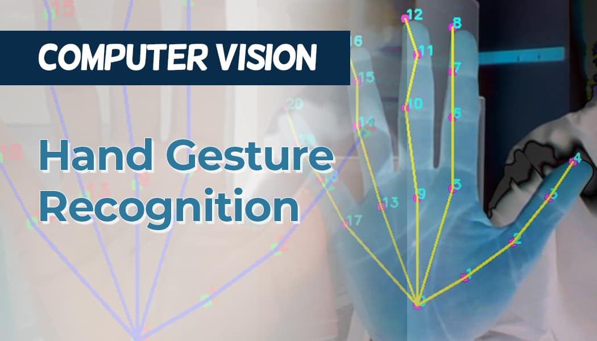

# Hand Gesture Recognition System

## DEPI Final Project

A real-time hand gesture recognition application built with Python, leveraging modern computer vision and machine learning techniques. The system captures hand gestures via webcam, processes them using MediaPipe for hand landmark detection, and classifies gestures using a trained machine learning model. The application features a user-friendly Streamlit interface for real-time interaction and supports containerized deployment with Docker.



## ✨ Features

- **Real-time Hand Tracking**: Utilizes MediaPipe's hand landmark detection for accurate hand tracking
- **Machine Learning Model**: Implements a trained classifier for recognizing various hand gestures
- **Modern Web Interface**: Built with Streamlit for a responsive and interactive user experience
- **Containerized Deployment**: Easy deployment with Docker for consistent environments
- **Model Training Pipeline**: Includes data preprocessing, model training, and evaluation scripts
- **Monitoring**: Integration with MLflow for experiment tracking and model management
- **Testing**: Comprehensive test suite for ensuring code reliability

## 🚀 Getting Started

### Prerequisites

- Python 3.8+
- Webcam
- Docker (for containerized deployment)

### Installation

1. **Clone the repository**
   ```sh
   git clone https://github.com/khaled-dotcom/depi-project.git
   cd depi-project
   ```

2. **Create and activate a virtual environment**
   ```sh
   python -m venv venv
   source venv/bin/activate  # On Windows: .\venv\Scripts\activate
   ```

3. **Install dependencies**
   ```sh
   pip install -r requirements.txt
   ```

4. **Set up environment variables**
   ```sh
   cp .env.example .env
   # Edit .env with your configuration
   ```

### Running the Application

#### Development Mode
```sh
streamlit run app.py
```

#### Production Mode with Docker
```bash
# Build the Docker image
docker build -t hand-gesture-app .

# Run the container
docker run -p 8501:8501 --rm hand-gesture-app
```

Access the application at [http://localhost:8501](http://localhost:8501)

## 🏗️ Project Structure

```
├── .github/              # GitHub Actions workflows
├── artifacts/            # Trained models and artifacts
├── Notebooks/            # Jupyter notebooks for exploration
├── src/                  # Source code
│   ├── __init__.py
│   ├── config.py         # Configuration settings
│   ├── inference.py      # Model inference logic
│   └── preprocessing.py  # Data preprocessing utilities
├── tests/                # Test files
├── .env.example          # Example environment variables
├── app.py                # Streamlit application
├── Dockerfile            # Docker configuration
├── requirements.txt      # Project dependencies
└── README.md             # This file
```

## 📊 Dataset

The model is trained on the [Hand Gesture Recognition Dataset](https://www.kaggle.com/datasets/anasalwajdeh/hand-gesture-recognition-dataset-one-hand) from Kaggle, which contains various hand gesture images for classification.

## 🛠️ Development

### Running Tests
```sh
pytest
```

### Model Training
Refer to the `Notebooks/` directory for model training and experimentation notebooks.

### Monitoring
- **MLflow** is used for experiment tracking and model management
- Access the MLflow UI with: `mlflow ui`

## 🤝 Contributing

Contributions are welcome! Please feel free to submit a Pull Request.

## 📝 License

This project is licensed under the MIT License - see the [LICENSE](LICENSE) file for details.

## 🙏 Acknowledgments

- MediaPipe for hand tracking
- Streamlit for the web interface
- Scikit-learn for machine learning capabilities
- The Kaggle community for the dataset
